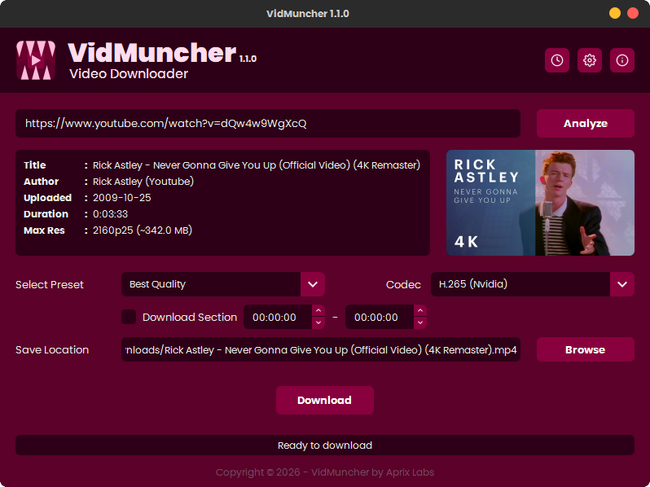

<div align="center">
  

# VidMuncher

**A Video Downloader Born from Pure Frustration**


[](https://github.com/aprixlabs/VidMuncher/blob/main/LICENSE)
[](https://github.com/aprixlabs/VidMuncher/releases)
[]()

</div>

I built this because a certain multi-billion dollar video editor throws a tantrum over unsupported codecs. I'm not a real developer, but out of pure, unadulterated spite, I accidentally engineered a hardware-accelerated, self-updating media devouring monster. It was supposed to be a simple 10-line script. Now it has transcode support and a GUI. Please use it so my suffering isn't in vain.

<div align="center">
  
</div>

## What It Does

- **Downloads videos** from YouTube and 1000+ other sites via yt-dlp. [View yt-dlp Supported sites](https://github.com/yt-dlp/yt-dlp/blob/master/supportedsites.md)
- **Transcode to H.264, H.265, or AV1** — NVIDIA, AMD, Intel QuickSync, or CPU. Falls back silently if your GPU refuses to cooperate. I simplified the codec options because most video editors only support these.
- **Audio extraction** for when you just want the audio
- **Download Sections** — clip a specific part of a video using timestamps (e.g., `*00:00:00-00:00:10`) without downloading the entire file
- **Self-configuring** — downloads yt-dlp and FFmpeg automatically on first launch. No manual setup required

## Getting Started

### Windows
**Installer (Recommended)**
1. Download the `-Installer.exe` from the latest release.
2. Run the installer and follow the setup wizard.
3. Launch from your Start Menu or Desktop shortcut.

**Portable**
1. Download the `-Portable.zip` from the latest release.
2. Extract the folder to your preferred location.
3. Run `VidMuncher.exe`.

> **⚠️ Windows SmartScreen Warning**
> Because this is an indie, open-source project without a paid Code Signing Certificate, Windows SmartScreen may flag the `.exe` as an "unrecognized app". This is completely normal.
> To run VidMuncher, click **"More info"** -> **"Run anyway"**.

### Linux Packages
**For Debian/Ubuntu:**
Download the `.deb` file from the latest release, then install:
```bash
sudo apt install ./vidmuncher_*.deb
```

**For Fedora/RHEL:**
Download the `.rpm` file from the latest release, then install:
```bash
sudo dnf install ./vidmuncher-*.rpm
```

**For Arch Linux (EndeavourOS/Manjaro):**
Download the `.pkg.tar.zst` file from the latest release, then install:
```bash
sudo pacman -U ./vidmuncher-*.pkg.tar.zst
```

### From Source
If you are adventurous and want to run it directly from the source code:
```bash
git clone https://github.com/aprixlabs/VidMuncher.git
cd VidMuncher
python -m venv .venv
source .venv/bin/activate  # On Windows: .venv\Scripts\activate
pip install -r requirements.txt
python src/vidmuncher.py
```

### Build Packages & Executables

**Prerequisites:**
- Python 3.10+ with `pip install -r requirements.txt`
- For Windows Installers: [Inno Setup 6](https://jrsoftware.org/isdl.php) must be installed.
- For Linux DEB: `dpkg-deb` and `fakeroot`.
- For Linux RPM: `rpmbuild`.
- For Arch Linux: `makepkg`.

To easily wrap the application into an installer:

**Windows Portable ZIP:**
```bash
packaging/windows/build_windows.bat
```

**Windows Installer (Setup.exe):**
```bash
packaging/windows/build_installer.bat
```

**Linux (.deb):**
```bash
packaging/linux/build_deb.sh
```

**Linux (.rpm):**
```bash
packaging/linux/build_rpm.sh
```

**Arch Linux (.pkg.tar.zst):**
```bash
packaging/linux/build_arch.sh
```

## Legal

Personal use only. Don't download things you shouldn't. [GPL-3.0 License](LICENSE).

## Thanks To

- **[yt-dlp](https://github.com/yt-dlp/yt-dlp)** — for doing the actual hard part
- **[FFmpeg](https://ffmpeg.org)** — for doing the other actual hard part
- **My video editor** — for being so picky about codecs that I had to build this

## Support VidMuncher
Keep my throat from getting scratchy:D

[](https://ko-fi.com/aprixlabs)